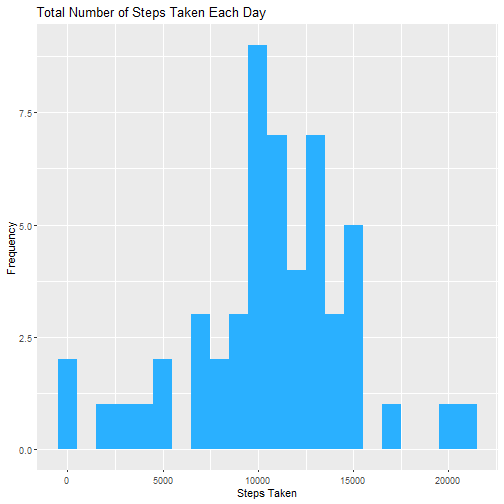
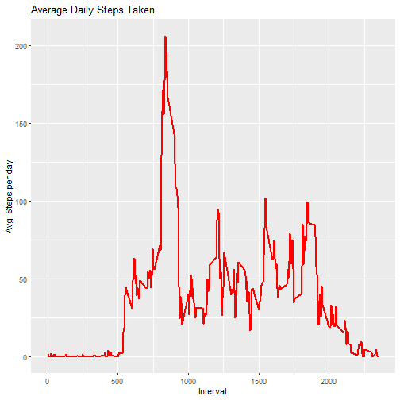
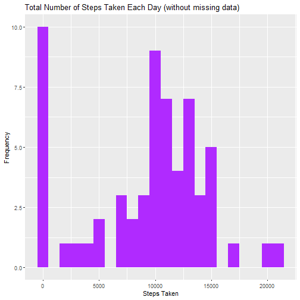

# Exploratory Data Analysis of a Person's Daily Movement

## Introduction

It is now possible to collect a large amount of data about personal
movement using activity monitoring devices such as a
[Fitbit](http://www.fitbit.com), [Nike
Fuelband](http://www.nike.com/us/en_us/c/nikeplus-fuelband), or
[Jawbone Up](https://jawbone.com/up). These type of devices are part of
the "quantified self" movement -- a group of enthusiasts who take
measurements about themselves regularly to improve their health, to
find patterns in their behavior, or because they are tech geeks. But
these data remain under-utilized both because the raw data are hard to
obtain and there is a lack of statistical methods and software for
processing and interpreting the data.

This project makes use of data from a personal activity monitoring
device. This device collects data at 5 minute intervals through out the
day. The data consists of two months of data from an anonymous
individual collected during the months of October and November, 2012
and include the number of steps taken in 5 minute intervals each day.

## Data

The data for this project can be downloaded from the web
site:

* Dataset: [Activity monitoring data](https://d396qusza40orc.cloudfront.net/repdata%2Fdata%2Factivity.zip) [52K]

The variables included in this dataset are:

* **steps**: Number of steps taking in a 5-minute interval (missing
    values are coded as `NA`)

* **date**: The date on which the measurement was taken in YYYY-MM-DD
    format

* **interval**: Identifier for the 5-minute interval in which
    measurement was taken


The dataset is stored in a comma-separated-value (CSV) file and there
are a total of 17,568 observations in this
dataset.


## Loading and preprocessing the data
Unzipping the activity.zip file to obtain the csv file and load it into R.


```r
library("data.table")
library(ggplot2)

unzip("activity.zip")


dataset <- data.table::fread(input = "activity.csv")
```


## What is mean total number of steps taken per day?
Questions to answers:
1. Calculating the total number of steps taken per day:


```r
total_steps <- dataset[, c(lapply(.SD, sum, na.rm = FALSE)), .SDcols = c("steps"), by = .(date)] 

head(total_steps)
```

```
##          date steps
## 1: 2012-10-01    NA
## 2: 2012-10-02   126
## 3: 2012-10-03 11352
## 4: 2012-10-04 12116
## 5: 2012-10-05 13294
## 6: 2012-10-06 15420
```

2. Making a histogram of the total number of steps taken each day:


```r
ggplot(total_steps, aes(x = steps)) +
    geom_histogram(fill = "#2ab0ff", binwidth = 1000) +
    labs(title = "Total Number of Steps Taken Each Day", x = "Steps Taken", y = "Frequency")
```




3. Calculate and report the mean and median of the total number of steps taken per day:

```r
mean_steps <- mean(total_steps$steps, na.rm = TRUE)
median_steps = median(total_steps$steps, na.rm = TRUE)
mean_steps
```

```
## [1] 10766.19
```

```r
median_steps
```

```
## [1] 10765
```

## What is the average daily activity pattern?
1. Making a time series plot (i.e. 𝚝𝚢𝚙𝚎 = "𝚕") of the 5-minute interval (x-axis) and the average number of steps taken, averaged across all days (y-axis)


```r
interval <- dataset[, c(lapply(.SD, mean, na.rm = TRUE)), .SDcols = c("steps"), by = .(interval)] 

ggplot(interval, aes(x = interval , y = steps)) +
  geom_line(color = "red", size = 1) +
  labs(title = "Average Daily Steps Taken", x = "Interval", y = "Avg. Steps per day")
```



2. Which 5-minute interval, on average across all the days in the dataset, contains the maximum number of steps?


```r
max_interval <- interval[steps == max(steps)]
max_interval
```

```
##    interval    steps
## 1:      835 206.1698
```


## Imputing missing values

1. Calculate and report the total number of missing values in the dataset (i.e. the total number of rows with 𝙽𝙰s)


```r
sum(is.na(dataset$steps))
```

```
## [1] 2304
```


2. Filling in all of the missing values in the dataset with the median


```r
dataset[is.na(steps), "steps"] <- dataset[, c(lapply(.SD, median, na.rm = TRUE)), .SDcols = c("steps")]
```


3. Creating a new dataset that is equal to the original dataset but with the missing data filled in.


```r
data.table::fwrite(x = dataset, file = "new_dataset.csv", quote = FALSE)
```


4. Creating a histogram of the total number of steps taken each day and calculate and report the mean and median total number of steps taken per day. 

```r
# Calculating the total number of steps taken per day again:
total_steps <- dataset[, c(lapply(.SD, sum, na.rm = TRUE)), .SDcols = c("steps"), by = .(date)] 

# Creating the new histogram:
ggplot(total_steps, aes(x = steps)) +
    geom_histogram(fill = "#b02aff", binwidth = 1000) +
    labs(title = "Total Number of Steps Taken Each Day (without missing data)", x = "Steps Taken", y = "Frequency")
```



```r
# Calculating the mean and medium again:
mean_steps <- mean(total_steps$steps, na.rm = TRUE)
median_steps = median(total_steps$steps, na.rm = TRUE)
mean_steps
```

```
## [1] 9354.23
```

```r
median_steps
```

```
## [1] 10395
```

Both mean and median values changed significantly after imputing the missing values. Mean changed about 1410.77 units and median changed about 370 units.

## Differences in activity patterns between weekdays and weekends
1. Creating a new factor variable in the dataset with two levels – “weekday” and “weekend” indicating whether a given date is a weekday or weekend day.

```r
dataset[, date := as.POSIXct(date, format = "%Y-%m-%d")]
dataset[, "day"] <- weekdays(x = dataset$date)
dataset[grepl(pattern = "Monday|Tuesday|Wednesday|Thursday|Friday", x = day), "day_type"] <- "weekday"
dataset[grepl(pattern = "Saturday|Sunday", x = day), "day_type"] <- "weekend"
dataset[, "day_type"] <- as.factor(dataset$day_type)
```
2. Making a panel plot containing a time series plot (i.e. 𝚝𝚢𝚙𝚎 = "𝚕") of the 5-minute interval (x-axis) and the average number of steps taken, averaged across all weekday days or weekend days (y-axis).


```r
interval <- dataset[, c(lapply(.SD, mean, na.rm = TRUE)), .SDcols = c("steps"), by = .(interval, day_type)] 

ggplot(interval , aes(x = interval , y = steps, color = day_type)) +
  geom_line() + 
  labs(title = "Average Daily Steps Taken by Daytype", x = "Interval", y = "No. of Steps Taken") + 
  facet_wrap(~day_type , ncol = 1, nrow=2)
```


